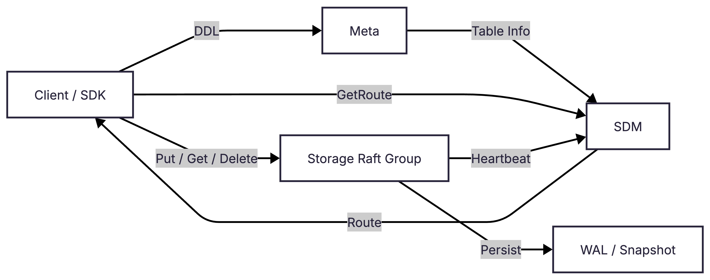

<h1 align="center">AdvisKV</h1>

<p align="center">
  <b>一个 C++17 分布式 KV 存储原型</b><br/>
  Raft 复制 · Meta/SDM 控制面 · 分片路由 · WAL/Snapshot 恢复 · E2E & Benchmark
</p>

<p align="center">
  
  
  <a href="LICENSE"></a>
  
  
</p>

<p align="center">
  <a href="README.md">English</a> ·
  <a href="#quick-start">Quick Start</a> ·
  <a href="https://www.zhihu.com/column/c_2057637599590797905">设计博客</a> ·
  <a href="docs/benchmark/README.md">Benchmark</a> ·
  <a href="#status">Status</a>
</p>

---

## 项目一句话

AdvisKV 把一套分布式 KV 系统从**控制面到数据面**完整拉通:Meta 管 DDL 与 catalog,SDM 用 reconciler 编排副本与 route,Storage 跑 Raft/WAL/Snapshot,SDK 走 `db + table + key` 路由到 leader。目前 V1 已在**本地 3 副本**下跑通 DDL、读写、扩缩容、异常副本替换、崩溃恢复、E2E 和 benchmark 全链路。

## Highlights

- **写路径攒批 propose**。Replica 侧用 `BatchDispatchQueue`(200µs / 64 条双触发)把多个 put 请求合成一次 Raft propose,单机 3 副本下 put QPS 从约 6.3k 提升到约 8.4k。
- **Table 副本数在线可变 + 异常副本自动补齐**。`AlterTableReplicaCount` 覆盖 `0 → N` / `N → 0` / `N → M` 全场景;副本进入 `LOST` / `ERROR` 后 SDM 自动清理并 `add_learner`;底层走 Raft single-server change,处理了 0→N 冷启动引导、2→1 缩容活性、Snapshot 携带 members 等 corner case,变更期间数据面持续对外服务。
- **Replica 内部 Event / Call 统一事件模型**。每个 Replica 一条 SerialTaskRunner,`Event`(异步 fire-and-forget)与 `Call`(同步等结果)用 `std::variant` 分派,把外部 RPC、Tick、Raft 内部回调都收敛到单线程串行处理,避免锁堆叠。
- **端到端已测试 + 本地 benchmark**。E2E 覆盖 restart / failover / follower catch-up / scale-to-zero / 副本扩缩容 / crash recovery;M3 Pro 单机 3 副本下,put P99 5.6 ms(9.8k QPS),get P99 2.2 ms(11k QPS)。

> 定位:面向"分布式 KV 架构学习 + 本地实验"的可运行原型,**不是**可直接生产部署的数据库。

## 架构

<p align="center">
  
</p>

- **Client / SDK**:走 `db + table + key` 路由,先 `GetRoute` 拿到 leader,再直连 Storage 做 `put/get/delete`;RouteCache 采用 COW + atomic snapshot,读路径无锁。
- **Meta**:DDL / catalog 的单一权威源,建表时把表信息交给 SDM 编排落地。
- **SDM**:reconciler 驱动的控制面,接收 Storage NodeAgent Heartbeat,下发 ExpectedReplica,把 desired state 收敛为 observed state,再对外发布 route。
- **Storage Raft Group**:多副本 Raft 复制,leader 负责写路径;WAL 顺序落盘、Snapshot install、Log truncate 与 crash recovery 全部覆盖。

数据面主链路的时序:

<p align="center">
  
</p>

关键点:
- SDK 侧先查 RouteCache;缺失或过期时回源到 SDM `GetTableRoutes / GetRoute`,再直连 Storage leader。
- Storage leader 侧走 `ReplicaManager → Replica::put → ProposeCall`,先本地 append Raft log 与 WAL,再发起 `AppendEntries`。
- Quorum commit 完成后立即回客户端 `OK / UNKNOWN / NOT_LEADER`,`apply committed log → StateMachine` 是**异步**动作——这也是 `NOT_YET_COMMIT → UNKNOWN` 语义存在的原因,由 SDK 层重试兜底。

更细的模块图:
- [SDM 最小架构](docs/assets/sdm-minimal-architecture.png)
- [Storage 最小架构](docs/assets/storage-minimal-architecture.png)
- [Meta 最小架构](docs/assets/meta-minimal-architecture.png)

## Quick Start

准备环境:macOS 或 Linux、C++17 编译器、CMake 3.20+、Ninja、Git、Python 3。

```bash
./scripts/setup.sh
./scripts/build.sh
./scripts/adviskvctl_demo.sh
```

`adviskvctl_demo.sh` 会自动拉起本地 `sdm/meta/storage`,并进入交互式 shell:

```text
create_db demo_db dc1
create_table demo_db demo_table 1 1 default
wait_table demo_db demo_table
put demo_db demo_table k1 v1
get demo_db demo_table k1
route demo_db demo_table k1
quit
```

停止本地进程:

```bash
./scripts/stop_cluster.sh
```

## Build

推荐使用脚本构建:

```bash
./scripts/build.sh
```

也可以使用 CMake presets:

```bash
cmake --preset release
cmake --build --preset release
```

常用构建变量:

```bash
BUILD_TYPE=Debug ./scripts/build.sh
BUILD_TARGETS="meta sdm storage adviskvctl" ./scripts/build.sh
```

主要二进制默认位于 `build/release/bin/`。

## Test

```bash
./scripts/run_test.sh
./scripts/e2e_pytest.sh
./scripts/coverage.sh
```

- `run_test.sh`:构建并运行 GoogleTest。
- `e2e_pytest.sh`:拉起本地多进程集群,验证 Meta → SDM → Storage → SDK 主链路。
- `coverage.sh`:生成覆盖率报告。

E2E 覆盖基础 KV、重启恢复、leader failover、follower catch-up、crash recovery、scale-to-zero、副本数调整和故障场景。

## Benchmark

本地端到端 benchmark,链路覆盖 `SDK → SDM route → Storage leader → Raft/WAL/KV`。结果来自单机多进程集群,只代表当前 V1 的一次测试结果,**不是生产环境性能承诺**。

测试环境:`Mac15,7`,Apple M3 Pro,12 物理核心 / 12 逻辑 CPU,36 GiB 内存;macOS 15.7.4,arm64。本地集群:`1 meta + 1 sdm + 5 storage`,所有进程都在同一台机器上,通过 `127.0.0.1/localhost` 通信。


默认场景:`threads=16`、`shard_count=2`、`replica_count=3`、`value_size=128`、`requests=30000`。

| Workload | Scenario | success_qps | avg_us | p95_us | p99_us |
|---|---|---:|---:|---:|---:|
| put | baseline | 9799.99 | 1631.30 | 2577 | 5623 |
| get | baseline | 11059.01 | 1445.76 | 1905 | 2211 |
| mixed | read_ratio=0.80 | 8229.54 | 1942.99 | 3358 | 4474 |

完整报告:

- [Put benchmark](docs/benchmark/benchmark_put.md)
- [Get benchmark](docs/benchmark/benchmark_get.md)
- [Mixed benchmark](docs/benchmark/benchmark_mixed.md)

运行单次 benchmark:

```bash
./scripts/bench.sh --workload=put --threads=4 --requests=10000 --replica_count=3
```

运行 benchmark 并生成 metrics 文本报告:

```bash
./scripts/bench_metrics.sh --workload=put --threads=4 --requests=10000 --replica_count=3
```

`bench_metrics.sh` 与 `bench.sh` 使用同一套参数,只是在 benchmark 期间采样服务端 `/metrics` 和 benchmark 客户端里的 SDK metrics,结束后输出报告路径:

```text
[bench] metrics report: build/release/bench_results/<run_id>/metrics_report.txt
```

## 设计博客

_(待整理)_

## Documentation

_(待整理)_

## Project Layout

```text
conf/       本地配置文件
proto/      gRPC / Protobuf 定义
scripts/    构建、测试、demo 和 benchmark 脚本
src/        Meta / SDM / Storage / SDK 与通用模块
tools/      adviskvctl、E2E 客户端、benchmark 客户端、storage 客户端
test/       GoogleTest 和 Python E2E 测试
docs/       设计文档、V1 约束、博客与 benchmark
```

## Status

AdvisKV 当前是 V1 prototype,具备可构建、可运行、可测试的分布式 KV 主链路。以下边界建议在阅读代码或复用思路时保持清醒:

- Meta 和 SDM 是单进程本地模式,尚未做高可用。
- 更完整的 auto rebalance、复杂成员变更策略、生产级运维仍在演进。
- route 与 leader 可写路由语义还需要更多故障场景验证。
- 当前使用 map-based KV engine,未接 RocksDB 等生产级 LSM 引擎;
- Benchmark 来自单机多进程,通过 `127.0.0.1` 通信,只用于本地调优和回归对比,不代表跨机真实网络的表现。

## License

AdvisKV 使用 [MIT License](LICENSE)。
