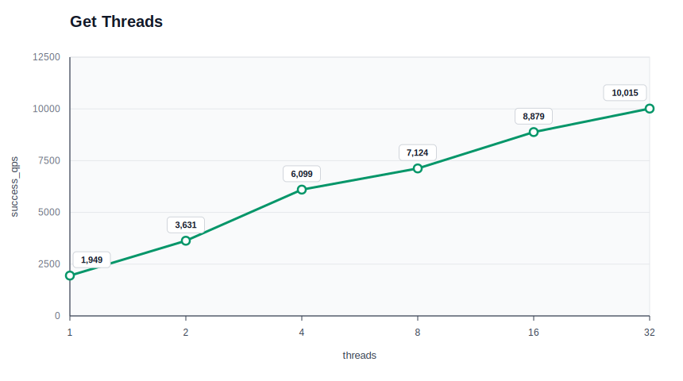
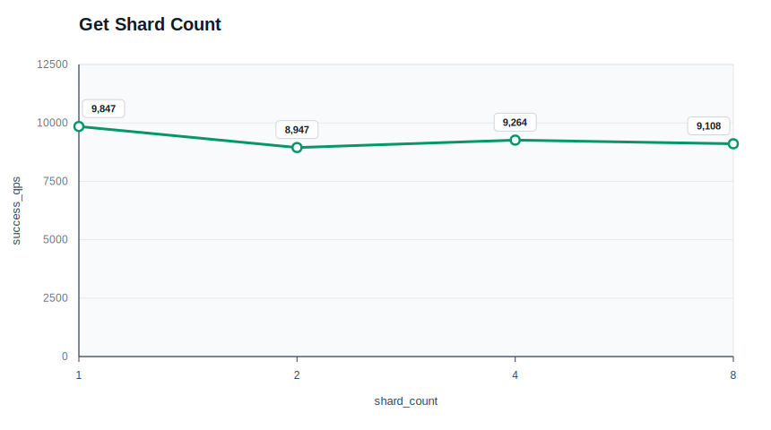
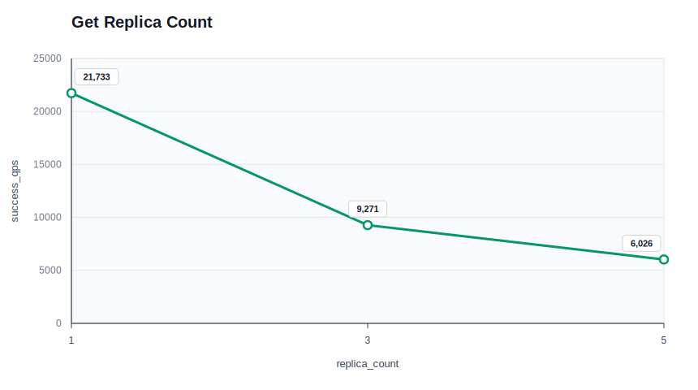
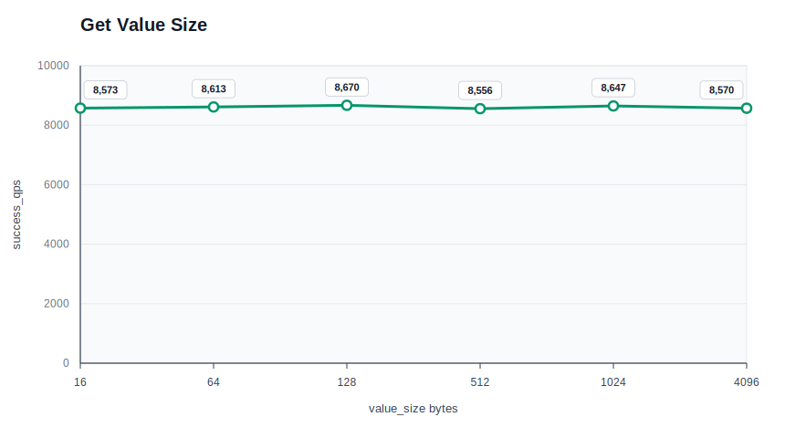

# AdvisKV V1 Get Benchmark

这份报告记录 AdvisKV V1 在本地环境下的 `get` benchmark，用于观察当前读链路的吞吐和延迟表现，并验证在压测环境下能否稳定完成请求。

## 测试范围

默认场景：

```text
workload      = get
threads       = 16
shard_count   = 2
replica_count = 3
value_size    = 128
requests      = 30000
```

除上面这些参数外，其余参数使用 `bench_client` 默认值：

```text
key_count       = 1000
warmup_requests = 0
```

本次只测试 `get`，每组只改变一个参数：`threads`、`shard_count`、`replica_count`、`value_size`。

当前 SDK 的 `get` 会通过 SDM 下发的 route 选择 leader replica 读，并经过 Storage 侧 ReadIndex 检查。因此这里的 get benchmark 衡量的是 leader-based linearizable read path，不是 follower read 或多副本分摊读流量。

## 测试环境

- 运行方式：`scripts/bench.sh` 拉起本地集群并运行 `bench_client`。
- 本地集群：`1 meta + 1 sdm + 5 storage`，所有进程都运行在同一台机器上，并通过 `127.0.0.1/localhost` 通信。
- 每个测试点会先写入 `key_count=1000` 的可读数据集，这部分准备阶段不计入正式 benchmark 结果。
- 测试机器：`Mac15,7`，Apple M3 Pro，12 物理核心 / 12 逻辑 CPU，36 GiB 内存。
- 操作系统：macOS 15.7.4 (24G517)，arm64。
- 构建方式：Release
- 生成时间：`20260707_191428`。
- 原始结果：[`benchmark_results/get_v1_snapshot.csv`](benchmark_results/get_v1_snapshot.csv)。

## 结果摘要

- `threads` 从 1 增加到 32 时，`success_qps` 从约 2420 提升到约 11716，同时 `avg_us`、`p95_us` 和 `p99_us` 也随并发上升而增加。
- `replica_count=1` 的读吞吐约 38335 QPS，`replica_count=3/5` 分别约 10884/5837 QPS。当前读路径仍走 leader 和 ReadIndex，因此副本数不代表读流量会被 follower 自动分摊。
- `value_size` 从 16 增加到 4096 bytes 时，`success_qps` 从约 10936 变化到约 10919。
- SDK 当前使用整表 route cache，正式 workload 阶段不再对每次请求做 SDM route resolve；所有测试点 `failure=0`。

## Threads

固定 `shard_count=2`、`replica_count=3`、`value_size=128`、`requests=30000`，调整 `threads`。



| threads | success_qps | avg_us | p50_us | p95_us | p99_us | failure |
|---:|---:|---:|---:|---:|---:|---:|
| 1 | 2420.22 | 412.63 | 406 | 459 | 573 | 0 |
| 2 | 4150.41 | 481.30 | 456 | 637 | 1015 | 0 |
| 4 | 7576.09 | 527.38 | 506 | 701 | 865 | 0 |
| 8 | 9034.12 | 884.76 | 869 | 1112 | 1307 | 0 |
| 16 | 11059.01 | 1445.76 | 1410 | 1905 | 2211 | 0 |
| 32 | 11715.51 | 2729.32 | 2644 | 4207 | 4996 | 0 |

## Shard Count

固定 `threads=16`、`replica_count=3`、`value_size=128`、`requests=30000`，调整 `shard_count`。



| shard_count | success_qps | avg_us | p50_us | p95_us | p99_us | failure |
|---:|---:|---:|---:|---:|---:|---:|
| 1 | 11500.82 | 1390.20 | 1347 | 1766 | 2010 | 0 |
| 2 | 10718.49 | 1491.73 | 1455 | 1967 | 2279 | 0 |
| 4 | 10290.97 | 1553.56 | 1497 | 2293 | 3024 | 0 |
| 8 | 10157.30 | 1574.01 | 1499 | 2544 | 3154 | 0 |

## Replica Count

固定 `threads=16`、`shard_count=2`、`value_size=128`、`requests=30000`，调整 `replica_count`。



| replica_count | success_qps | avg_us | p50_us | p95_us | p99_us | failure |
|---:|---:|---:|---:|---:|---:|---:|
| 1 | 38334.88 | 416.44 | 399 | 636 | 763 | 0 |
| 3 | 10883.83 | 1468.96 | 1433 | 1981 | 2302 | 0 |
| 5 | 5836.62 | 2739.83 | 2557 | 3895 | 6252 | 0 |

## Value Size

固定 `threads=16`、`shard_count=2`、`replica_count=3`、`requests=30000`，调整 `value_size`。



| value_size | success_qps | avg_us | p50_us | p95_us | p99_us | failure |
|---:|---:|---:|---:|---:|---:|---:|
| 16 | 10935.54 | 1461.99 | 1431 | 1922 | 2209 | 0 |
| 64 | 10354.30 | 1544.12 | 1500 | 2080 | 2454 | 0 |
| 128 | 11030.81 | 1449.40 | 1411 | 1905 | 2316 | 0 |
| 512 | 10654.60 | 1500.46 | 1450 | 1962 | 2329 | 0 |
| 1024 | 10098.35 | 1583.37 | 1506 | 2301 | 3203 | 0 |
| 4096 | 10918.96 | 1464.22 | 1437 | 1900 | 2173 | 0 |

## 复现方式

```bash
BENCH_LOG_LEVEL=warning \
  ./scripts/bench.sh \
  --workload=get \
  --threads=16 \
  --shard_count=2 \
  --replica_count=3 \
  --value_size=128 \
  --requests=30000 \
  --output_json=build/release/bench_results/get_baseline.json
```
