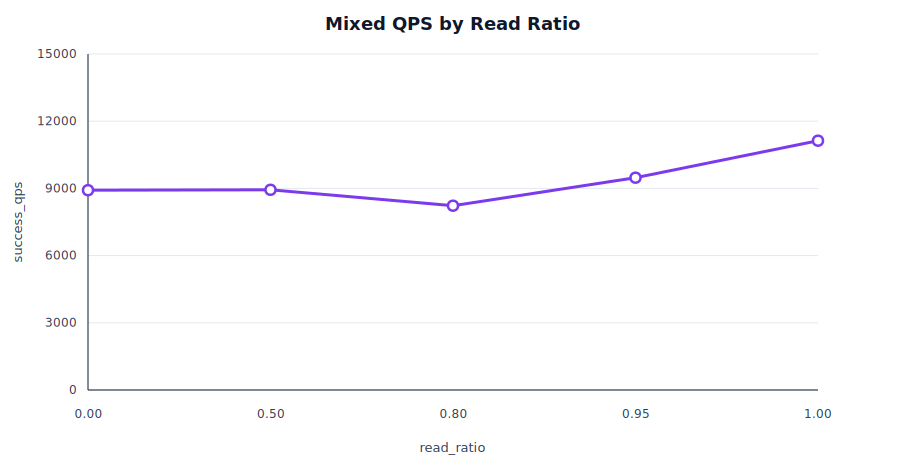

# AdvisKV V1 Mixed Benchmark

这份报告记录 AdvisKV V1 在本地环境下的 `mixed` benchmark，用于观察当前混合读写链路的吞吐和延迟表现，并验证在压测环境下能否稳定完成请求。

## 测试范围

默认场景：

```text
workload      = mixed
threads       = 16
shard_count   = 2
replica_count = 3
value_size    = 128
requests      = 30000
```

除上面这些参数外，其余参数使用 `bench_client` 默认值：

```text
key_count       = 1000
warmup_requests = 0
```

本次只改变 `read_ratio`：

```text
read_ratio = 0.0, 0.5, 0.8, 0.95, 1.0
```

## Mixed 语义

`mixed` benchmark 会先预写 `key_count=1000` 个 key。正式阶段在这些已有 key 上按 `read_ratio` 随机执行 `get` 或 `put`，准备阶段不计入正式 benchmark 结果。

## 测试环境

- 运行方式：`scripts/bench.sh` 拉起本地集群并运行 `bench_client`。
- 本地集群：`1 meta + 1 sdm + 5 storage`，所有进程都运行在同一台机器上，并通过 `127.0.0.1/localhost` 通信。
- 测试机器：`Mac15,7`，Apple M3 Pro，12 物理核心 / 12 逻辑 CPU，36 GiB 内存。
- 操作系统：macOS 15.7.4 (24G517)，arm64。
- 构建方式：Release
- 生成时间：`20260705_212402`。
- 原始结果：[`benchmark_results/mixed_v1_snapshot.csv`](benchmark_results/mixed_v1_snapshot.csv)。

## 结果摘要

- `read_ratio=0.0` 时，`success_qps` 约 8293。
- `read_ratio=0.8` 时，`success_qps` 约 7538，这是本报告建议作为 mixed 默认读多写少场景引用的点。
- `read_ratio=1.0` 时，`success_qps` 约 8846。
- 所有测试点 `failure=0`。

## Read Ratio

固定 `threads=16`、`shard_count=2`、`replica_count=3`、`value_size=128`、`requests=30000`，调整 `read_ratio`。



| read_ratio | expected_read | expected_write | success_qps | avg_us | p50_us | p95_us | p99_us | failure |
|---:|---:|---:|---:|---:|---:|---:|---:|---:|
| 0.00 | 0% | 100% | 8293.12 | 1928.18 | 1721 | 3007 | 6316 | 0 |
| 0.50 | 50% | 50% | 7239.59 | 2208.84 | 1815 | 4867 | 7441 | 0 |
| 0.80 | 80% | 20% | 7537.85 | 2121.47 | 1904 | 3507 | 4686 | 0 |
| 0.95 | 95% | 5% | 8292.30 | 1928.37 | 1813 | 3015 | 3728 | 0 |
| 1.00 | 100% | 0% | 8846.28 | 1807.47 | 1764 | 2429 | 2939 | 0 |

## 复现方式

```bash
BENCH_LOG_LEVEL=warning \
  ./scripts/bench.sh \
  --workload=mixed \
  --read_ratio=0.80 \
  --threads=16 \
  --shard_count=2 \
  --replica_count=3 \
  --value_size=128 \
  --requests=30000 \
  --output_json=build/release/bench_results/mixed_baseline.json
```
