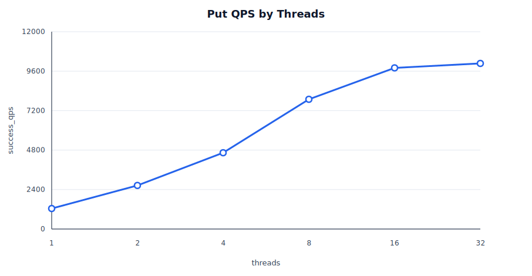
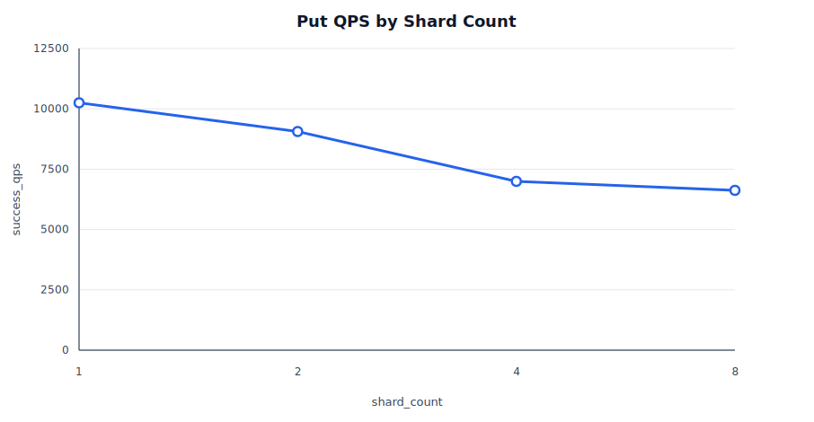
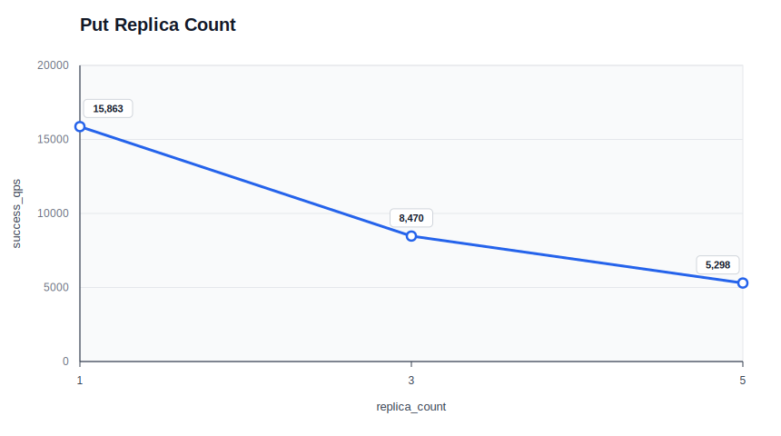
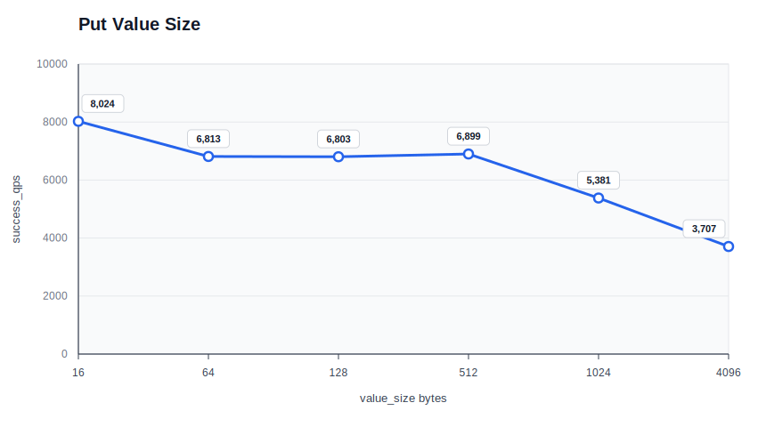

# AdvisKV V1 Put Benchmark

这份报告记录 AdvisKV V1 在本地环境下的 `put` benchmark，用于观察当前写链路的吞吐和延迟表现，并验证在压测环境下能否稳定完成请求。

## 测试范围

默认场景：

```text
workload      = put
threads       = 16
shard_count   = 2
replica_count = 3
value_size    = 128
requests      = 30000
```

除上面这些参数外，其余参数使用 `bench_client` 默认值：

```text
key_count       = 1000
warmup_requests = 0
```

本次只测试 `put`，每组只改变一个参数：`threads`、`shard_count`、`replica_count`、`value_size`。

## 测试环境

- 运行方式：`scripts/bench.sh` 拉起本地集群并运行 `bench_client`。
- 本地集群：`1 meta + 1 sdm + 5 storage`，所有进程都运行在同一台机器上，并通过 `127.0.0.1/localhost` 通信。
- 测试机器：`Mac15,7`，Apple M3 Pro，12 物理核心 / 12 逻辑 CPU，36 GiB 内存。
- 操作系统：macOS 15.7.4 (24G517)，arm64。
- 构建方式：Release
- 生成时间：`20260707_191428`。
- 原始结果：[`benchmark_results/put_v1_snapshot.csv`](benchmark_results/put_v1_snapshot.csv)。

## 结果摘要

- `threads` 从 1 增加到 32 时，`success_qps` 从约 1246 提升到约 10073，同时 `avg_us`、`p95_us` 和 `p99_us` 也随并发上升而增加。
- `replica_count=1` 的写入吞吐约 21305 QPS，高于 `replica_count=3/5` 的约 9765/4837 QPS，符合 Raft 多副本写入需要复制和提交的成本预期。
- `value_size` 从 16 增加到 4096 bytes 时，`success_qps` 从约 10471 下降到约 4193，写入 payload 变大后复制、WAL 和网络序列化成本会更明显。
- `shard_count` 在本地单机多进程环境下没有表现出稳定线性提升，结果会受到 Storage node 数量、leader 分布和单机资源竞争影响。
- SDK 当前使用整表 route cache，正式 workload 阶段不再对每次请求做 SDM route resolve；所有测试点 `failure=0`。

## Threads

固定 `shard_count=2`、`replica_count=3`、`value_size=128`、`requests=30000`，调整 `threads`。



| threads | success_qps | avg_us | p50_us | p95_us | p99_us | failure |
|---:|---:|---:|---:|---:|---:|---:|
| 1 | 1246.25 | 801.82 | 776 | 972 | 1282 | 0 |
| 2 | 2648.37 | 754.56 | 714 | 999 | 1161 | 0 |
| 4 | 4640.35 | 861.33 | 794 | 1243 | 1857 | 0 |
| 8 | 7889.13 | 1013.22 | 898 | 1630 | 2957 | 0 |
| 16 | 9799.99 | 1631.30 | 1456 | 2577 | 5623 | 0 |
| 32 | 10073.04 | 3173.94 | 2608 | 6353 | 13534 | 0 |

## Shard Count

固定 `threads=16`、`replica_count=3`、`value_size=128`、`requests=30000`，调整 `shard_count`。



| shard_count | success_qps | avg_us | p50_us | p95_us | p99_us | failure |
|---:|---:|---:|---:|---:|---:|---:|
| 1 | 10249.46 | 1559.98 | 1393 | 2233 | 6428 | 0 |
| 2 | 9058.31 | 1764.88 | 1564 | 3040 | 5683 | 0 |
| 4 | 6995.72 | 2285.48 | 1759 | 5404 | 8430 | 0 |
| 8 | 6620.59 | 2414.43 | 1717 | 6847 | 11808 | 0 |

## Replica Count

固定 `threads=16`、`shard_count=2`、`value_size=128`、`requests=30000`，调整 `replica_count`。



| replica_count | success_qps | avg_us | p50_us | p95_us | p99_us | failure |
|---:|---:|---:|---:|---:|---:|---:|
| 1 | 21304.98 | 749.93 | 686 | 1117 | 2822 | 0 |
| 3 | 9765.28 | 1637.20 | 1445 | 2588 | 6041 | 0 |
| 5 | 4836.82 | 3306.39 | 2494 | 7108 | 13060 | 0 |

## Value Size

固定 `threads=16`、`shard_count=2`、`replica_count=3`、`requests=30000`，调整 `value_size`。



| value_size | success_qps | avg_us | p50_us | p95_us | p99_us | failure |
|---:|---:|---:|---:|---:|---:|---:|
| 16 | 10470.97 | 1526.82 | 1349 | 2473 | 5518 | 0 |
| 64 | 9631.98 | 1659.94 | 1461 | 2763 | 5717 | 0 |
| 128 | 9767.49 | 1636.92 | 1421 | 2603 | 5900 | 0 |
| 512 | 9085.66 | 1759.68 | 1555 | 2927 | 6064 | 0 |
| 1024 | 8183.90 | 1953.84 | 1636 | 3893 | 6890 | 0 |
| 4096 | 4192.82 | 3814.00 | 2813 | 9694 | 14826 | 0 |

## 复现方式

```bash
BENCH_LOG_LEVEL=warning \
  ./scripts/bench.sh \
  --workload=put \
  --threads=16 \
  --shard_count=2 \
  --replica_count=3 \
  --value_size=128 \
  --requests=30000 \
  --output_json=build/release/bench_results/put_baseline.json
```
