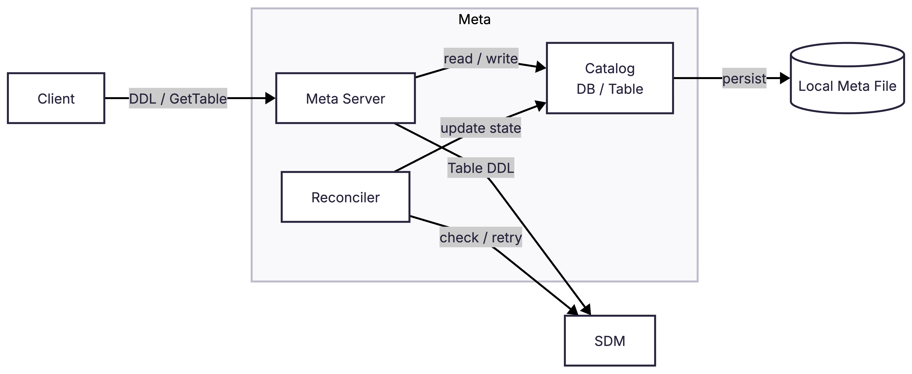
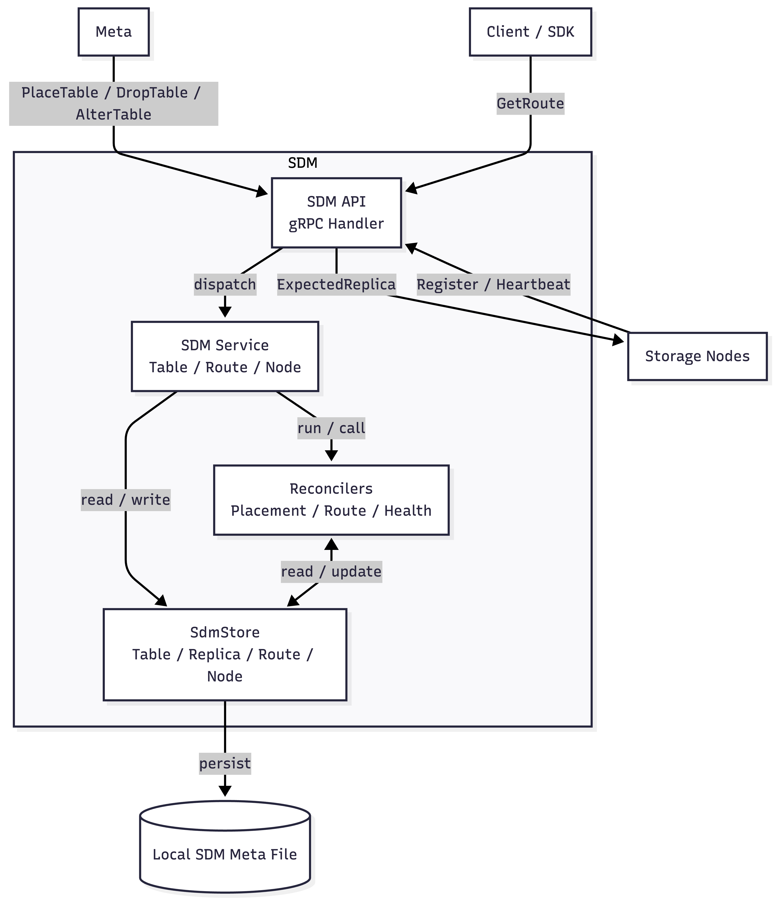
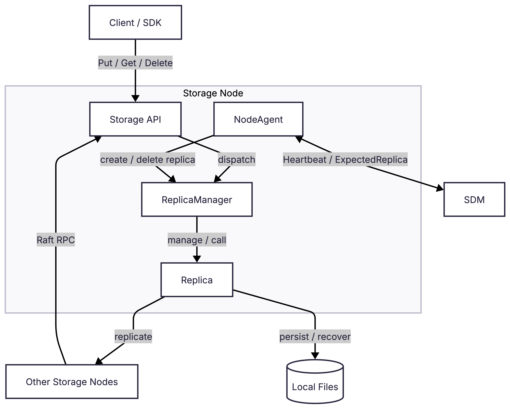

# 日期: 2026.7.6

## 写在开头的开头

AdvisKV 是我用 C++17 从零写的一个分布式 KV 存储系统原型，包含 Meta、SDM、Storage、SDK 四个主要模块，覆盖建库建表、路由查询、KV 读写、副本数扩缩容、坏副本替换、Raft、WAL/snapshot 恢复，跑了gtest + E2E 测试和 benchmark。（但是控制面高可用、自动 rebalance、接入rocksdb这些还没实现）

项目地址：https://github.com/advisedy/adviskv

## 写在开头

也算是很久没有写blog了，上次写还是OB复赛打完了之后写的一篇凄凄惨惨的总结文，一晃半年过去了。没想到距离自己上次写随笔都是半年前的事情了。先简单交代一下自己的背景吧，自从比赛打完了之后，就开始准备找实习了，找实习其实并没有我想象中很困难，我大概面了有五六家，字节的基架，OB的数据库内核开发，还有一些小厂的杂七杂八，游戏引擎，自动驾驶等等刷刷面试经验。本来是打算投字节给面试OB涨点经验的，结果没想到字节的效率太快了，没几天就发了offer。最后自己纠结了下，害怕自己选择数据库内核后路走窄了，就想着去基础架构试试吧。

后来是差不多实习了有1个月吧，发现自己实习基本上没有学到什么，实际的代码开发都没有多少，每天就是在排查问题，简单的改点代码，测试性能之类的，我就在想，如果我保持现在这样到秋招，自己恐怕到时候成废物了，而组内的项目代码又不可能会让我来参与实际代码开发，我总得另寻出路。恰巧组内的项目是做分布式KV的，那不如了解清楚组内的项目，然后我去写一个自己的分布式KV。（好歹以后面试的时候，发现我的实习内容很水，我可以狡辩一下，说自己私下学习组内项目，自己搓了个分布式KV出来

有点小丑的是，由于自己设定的场景和组内的不同，以及V1版本的功能方面没办法实现的很全面，导致自己魔改了之后，可以说除了模块名字几乎和组内的项目都不沾边了。

至此，以上就是我打算写这个分布式KV，AdvisKV的想法了。

其实也有点想抱着做出来自己的一个代表作的想法，毕竟之前写的那些rmdb，miniob，seekdb的代码都不算是我自己的项目。

开始写这个文档的时候，项目基本上完成的差不多了吧，benchmark起码可以完整跑通（bushi。 想着架构啥的肯定不会大改了（并不是这样的，后来又重构了很多），顶多就是后期可能再会尝试优化下性能，以及删除我项目里面加的乱七八糟的注释，所以差不多就可以开笔了。

## **AdvisKV 是什么**

简单来说，AdvisKV 是我用 C++17 写的一个分布式 KV 存储系统原型。实现它的原因，说的功利一点，就是希望可以秋招体面一点。顺带其实也希望可以完成自己的第一个从头开始搞的项目。希望各位不要期望太高，定位并没有多高，就是一个学习向系统的原型罢了。

大概概括这个项目的主线的话，就是 Meta/SDM 作为控制面维护表、副本和路由的期望状态，Storage 作为数据面负责 KV 读写和 Raft 复制，控制面和数据面通过心跳和 reconciler 不断把系统状态收敛到预期。

这个项目里面大概分成四个模块：

`Meta` 负责DB，Table这些元数据和DDL。

`SDM` 负责 Storage 节点注册、心跳、ReplicaGroup 编排、期望副本下发和 Route 维护。

`Storage` 负责 KV 数据读写、Raft 和本地持久化。

`SDK` 对外提供基于 `db + table + key` 的put/get/delete 接口。

目前这个项目可以跑通建库建表，路由查询，KV的读操作写操作，副本数调整，自动替换坏了的副本，raft，WAL，snapshot，recover等这些功能，然后目前有两百多个gtest单测，一批E2E测试（例如最基础的端到端 KV 链路，leader崩溃后切主，follower追日志和追snapshot，Meta/SDM重启恢复啊等等等等），还有benchmark和metrics。

关于详细的内容和数据这里就不详说了，我更想的其实是写关于这个项目的自我感受（一直以来就是这个样子，所以就不写的那么官方味了）。

这里贴上github地址: https://github.com/advisedy/adviskv，想了解的可以去README里面查看。

## **Show**

这个分布式KV的数据模型，就像和正常的数据库差不多，会有db，table的概念。

用户可以创建自己的DB，然后在DB里面创建table。每一个 table 在创建的时候可以指定 shard 数和 replica 数。一个 table 会被拆成多个 shard，每一个 shard 又会有多个 replica。这里需要说明一下，V1 版本里 shard 数是在创建 table 的时候确定的，后续暂时不能动态修改；replica 数现在可以通过 alter_table 去调整，也支持缩到 0 再扩回来。也就是说，目前不是完全没有扩缩容，只是支持的是副本数这条链路，自动 rebalance 和 shard 数变更还没有做（以后应该也不会做了吧，这个项目应该已经要到此为止了）。

```Bash
# 项目里提供了一个交互式 CLI adviskvctl， 方便进行演示(AI大哥跑的，我只是简单看了看)

# 建库建表
adviskv> create_db demo_db dc1
OK db_id=1

# create_table <db> <table> <shards> <replicas> <resource_pool>
adviskv> create_table demo_db demo_table 4 3 default
OK table_id=1

# wait_table <db> <table> [timeout_ms]
adviskv> wait_table demo_db demo_table
OK table_state=NORMAL

# put <db> <table> <key> <value>
adviskv> put demo_db demo_table hello world
OK

# get <db> <table> <key>
adviskv> get demo_db demo_table hello
OK value="world"

adviskv> delete demo_db demo_table hello
OK

# route <db> <table> <key>
adviskv> route demo_db demo_table hello
Route
  table: demo_db.demo_table
  key:   hello
  shard: table_id=1 shard_id=2
  replicas:
    - replica_id=1:2:0 endpoint=127.0.0.1:50051 role=LEADER
    - replica_id=1:2:1 endpoint=127.0.0.1:50052 role=FOLLOWER
    - replica_id=1:2:2 endpoint=127.0.0.1:50053 role=FOLLOWER
# key hello 会先定位到 table 某个 shard，然后 SDK 再通过 SDM 查询该 shard 对应的 route，通过 route 上的 endpoint，最终把请求发送到对应的 leader 的 Storage 节点

# 这里是副本的扩容缩容
# alter_table <db> <table> <replicas>
adviskv> alter_table demo_db demo_table 2
OK table_id=1 replica_count=2
```

然后关于这个KV，我们目前支持的操作就是最基本的同步的put，get，delete。关于这些操作，是交给我们的sdk模块使用的。我们可以创建一个`KVClient`进行put，get等操作。这里顺手说一下，CLI 里面命令可以写 delete，SDK 里面对应的方法名叫 del。

这个是我们简单的SDK的使用方式：

```C++
#include <iostream>
#include "sdk/client.h"

int main() {
    adviskv::sdk::KVClientConf conf;
    conf.db_name = "demo_db";
    conf.table_name = "demo_table";
    conf.sdm_host = "127.0.0.1";
    conf.sdm_port = 50049;
    conf.sdm_timeout_ms = 3000;
    conf.storage_timeout_ms = 3000;

    adviskv::sdk::KVClient client(conf);

    adviskv::Status put_status = client.put("hello", "world");
    if (put_status.fail()) {
        std::cerr << put_status.to_string() << std::endl;
        return 1;
    }

    adviskv::Value value;
    adviskv::Status get_status = client.get("hello", &value);
    if (get_status.ok()) {
        std::cout << value << std::endl; // value:"world"
    }

    return 0;
}
```

## Minimal Overview


## 整体架构的粗略介绍

这个项目主要是分为了四个模块: meta，sdm， storage， sdk。

### SDK

先来说一下最外层的sdk，sdk其实本身并不算是隶属在分布式KV里面的服务端模块，它就是一个客户端库，给使用者执行put，get这种操作。

拿 put 操作来说，在当前版本里，sdk 会先向 sdm 查询 route，也就是路由表。这个 route 里面包含当前 db/table 对应的 shard 信息，以及每个 shard 下面的 replica 节点信息。sdk 根据 key 算出它应该落在哪一个 shard 上，然后从这个 shard 的 replica 列表里面找到 leader 节点，然后直接给这个节点发送put操作。删除操作也是这个样子。值得一提的是，在我们的V1版本里面，get操作也是只有leader才可以执行。（后续版本会考虑优化这里）

### Meta

Minimal architecture diagram:



这个模块主要负责 DDL 和 DB/Table 这些元信息。

创建 table 的时候，请求会先打到 Meta。Meta 收到 CreateTable 之后，会先在自己的 catalog 里面记录这个 table，并把 table 状态标记成创建中的状态。然后 Meta 会向 SDM 发送 PlaceTable 请求，让 SDM 去负责后续的 replica 放置和 route 生成。

这里需要注意的是，CreateTable 返回成功并不一定代表这个 table 立刻就已经可以读写了。这个接口本身是一个异步操作，返回的OK只是代表meta这边接受了这个DDL，并不保证DDL最后一定会成功。后续 table 是否真正 ready，主要是取决 Meta 和 SDM 里的后台 reconciler 能否把状态推进到最终状态。

后面做副本数调整之后，这里也多了 AlterTableReplicaCount。用户发起 alter_table 的时候，Meta 会先把 catalog 里面的 replica_count 和状态改掉，然后通知 SDM 去把每个 shard 的目标副本数调到新值。这个过程也不是同步等所有 replica 都调整完，最后还是靠后台 reconciler 推回来。

而创建db这种操作的话，就不会发送给sdm，因为像DB这边的概念，是只有meta才会知晓的概念，sdm那边不会在乎db，也不会持久化db。sdm侧应当只会关心table，以及对应的shard_count和replica_count来进行编排。虽然sdk通过传递db_name和table_name和hash(key)找到路由表，但是db_name这个其实是附在table上的，所以对于db而言，不需要往sdm知道，sdm只需要了解到table的内容其实就可以了。

### SDM

Minimal architecture diagram:



sdm 维护了一个很重要的东西就是 route。route是以shard为单位的，每一个shard都会有个对应的route。sdk 每次要 put/get/delete 的时候，会先拿 db_name 和 table_name 去 sdm 查询路由表，然后根据 key 算出对应的 shard，再从 shard 的 replica 列表里面找到 leader 节点，最后把真正的 KV 请求发给 storage。

另外，sdm还会负责 storage 节点的注册和心跳。storage 启动之后，会向 sdm 注册自己，然后周期性发送 heartbeat。 heartbeat 不只是告诉 sdm 目前节点还没有掉点，还会把本机 replica 的状态、raft role、成员信息（leader会传）这些发过去；sdm 也会在 heartbeat response 里面下发期望的 Replica，让 storage 的 NodeAgent 在本机创建、删除 replica，或者做成员变更。sdm 和 storage 这边用的就是经典的观测-期望，sdm 维护期望状态，再让 NodeAgent 去收敛。自动 rebalance 的话就没考虑再做了（再做也赶不上秋招了）

还有，由于 sdm 需要提供 route，这边sdk的链路是通过提供db_name + table_name + key向sdm查询一下路由表，所以sdm这边需要有table的概念，也需要知道每个table下面有多少个shard。table里面还有 ReplicaGroup 这一层，每个shard都会对应了一个group，用来维护这个shard希望有几个副本、哪些replica是当前还想保留的成员。而shard作为我们的逻辑数据，所以并没有在sdm里面专门出现，通过ReplicaGroup + Route的方式在代码层面实现的。

由于我们用的经典的观测期望，所以关于后台任务的话，现在主要靠几类后台reconcile去推动状态：TableReconciler 负责判断 table 是否 ready/deleting，ReplicaGroupReconciler 负责根据 target_replica_count 去补副本、删副本、替换坏副本，Route 负责在 replica ready 之后发布可用路由。说起来还是稍微有点绕的，但是核心想法其实就是把“应该是什么样子”和“现在实际是什么样子”不断对齐。之后等到要讲 sdm 的时候再细讲吧。

### Storage

Minimal architecture diagram:



storage 负责数据的读写，前面的 meta 和 sdm 更偏控制面一些，一个负责元信息，一个负责路由和节点状态；storage 这边是真正处理 put/get/delete 请求，以及维护数据副本的地方。

拿 put/delete 操作来说，sdk 直接把请求打到对应 shard 的 leader 所在的 storage 节点上。打向storage写请求之后，这个写请求就会进入 replica 内部，交给 raft 做复制。首先本地会写一条 raft log，然后发送给其他的 follower，等待这个 log 被多数派确认并且提交之后，会 apply 到 KV engine。当前版本里的 KV engine 还是一个比较简单的 map engine，主要是为了先把分布式链路跑通。（后续有考虑接入rocksdb，maybe，maybe考虑）

get操作来说的话，其实目前也只是leader-only的状态，最终的读请求也只会打到leader上。不过搞了个读一致性，在读之前会确认自己仍然是合法 leader，并确保本地状态机至少 apply 到对应的 read index，避免读到旧 leader 或者还没 apply 完的状态。

除此之外，storage 还做了 WAL 和 snapshot 相关的持久化逻辑，当前实现里，WAL 主要承载的是 Raft log，用来记录每个 replica 的写入日志；snapshot 则保存已经 apply 之后的 KV 状态。服务重启时，可以通过 snapshot 加上后续 WAL 恢复 replica 状态。

## V1的局限

其实目前还有很多没有完成的内容，例如

- Meta 和 SDM 在V1版本里只打算做单进程，没有高可用
- Storage侧目前的 kv engine 直接用了map，还没有接入rocksdb
- 关于 shard 目前不支持 split，也没有实现自动 rebalance
- 目前只支持 leader put 和 read，不支持follower read

## 写在最后

最开始写完这个blog是6月12号，但是后来又进行了大规模的重构，并且加上了支持扩缩容这个功能（为了这个功能真的是重构了好多好多），拖到现在都有一个月了。为啥要支持扩缩容，是我当时想结束这个项目的时候，了解到了tinykv这个项目，然后发现它的完全体几乎是全方面吊打我的项目了，所以悲痛欲绝，想着怎么也得多实现个功能吧，不然太小丑了。（再给我一次机会，我可能就不会写这个项目了，直接去实现tinykv不香吗......)

以上，大体上讲了下这个项目，其实这个项目算是完成的不太好，应该会有很多设计不太合理的地方。毕竟我也没有系统的学习过分布式，很多东西也是边看、边查、边问、边写出来的。很多设计甚至并没有一开始就想清楚的，经常写到一半然后发现不对，再慢慢修修补补出来的。

如果有同学抱着学习分布式 KV 的想法来看这个项目，发现里面有一些设计看起来很奇怪，那大概率不是你理解错了，可能就是我这里确实还没设计好。后面的文章我也会尽量把这些地方讲清楚，包括哪些是当前版本的取舍，哪些是后续应该继续改的地方。

这篇就作为 AdvisKV 文档系列的开坑文，暂且写到这里吧，to be continue。
