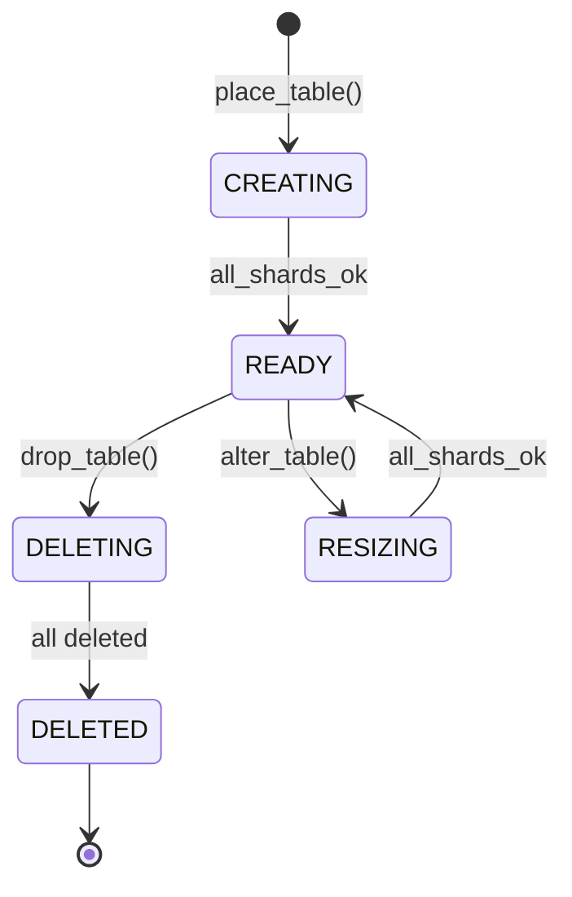
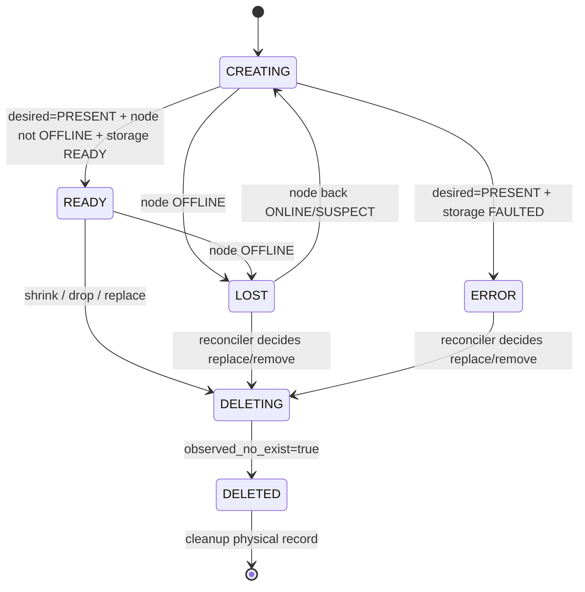
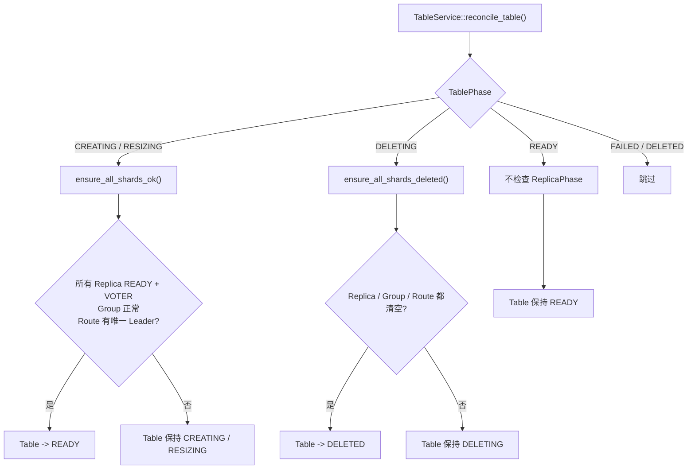

# adviskv SDM V1 状态规则

这份文档记录 SDM 当前确认的生命周期规则。这里的目标不是描述所有未来能力，而是固定 V1 代码应该遵守的状态语义，后续重构和测试都按这里检查。

## 1. 字段 owner

一个字段原则上只能有一个业务 owner。其他模块可以读它，但不要直接改它的语义状态。

| 字段 | Owner | 说明 |
|---|---|---|
| `Node.state.status` | `NodeService` | 节点心跳生命周期：`ONLINE / SUSPECT / OFFLINE` |
| `Node.state.endpoint` | `NodeService` | 节点心跳上报的地址 |
| `Node.state.last_heartbeat_ts` | `NodeService` | 最近心跳时间 |
| `Replica.state.observed_*` | `NodeService` | storage 心跳上报的原始事实 |
| `Replica.state.observed_no_exist` | `NodeService` | 节点心跳没有再上报 `DELETING` replica，表示 storage 侧已不存在 |
| `Replica.state.desired` | `ReplicaGroupService` | 单个 replica 是否还被 SDM 期望存在 |
| `Replica.state.phase` | `ReplicaGroupService` | 单个 replica 的生命周期阶段 |
| `ReplicaGroup.target_replica_count` | `ReplicaGroupService` | shard 目标副本数 |
| `ReplicaGroup.desired_members` | `ReplicaGroupService` | shard 当前希望保活的 replica 集合，也是 heartbeat `PRESENT / ABSENT` 判据 |
| `ReplicaGroup.mode` | `ReplicaGroupService` | `BOOTSTRAP / RAFT_RECONFIG` 成员变更模式 |
| `Table.spec.*` | `TableService` API | 建表、删表、扩缩容 API 写入 |
| `Table.state.desired` | `TableService` | table 期望存在与否 |
| `Table.state.phase` | `TableService` | table 生命周期阶段 |

`update_ts` 是例外字段，谁改当前对象的状态，谁顺手更新。

## 2. 外部 Table 操作约束

V1 里外部 DDL 不并发。

| 操作 | 允许条件 | 状态变化 |
|---|---|---|
| `CREATE_TABLE` | table 不存在，或同 `operation_id` 幂等重试 | `[*] -> CREATING` |
| `ALTER_TABLE replica_count` | `TableDesired=PRESENT` 且 `TablePhase=READY` | `READY -> RESIZING` |
| `DROP_TABLE` | `TableDesired=PRESENT` 且 `TablePhase=READY` | `READY -> DELETING` |

`operation_id` 由调用方保证按操作类型生成，例如 `create-table-*`、`alter-table-replica-count-*`、`drop-table-*`。因此同一个 API 里，如果 `operation_id` 相同，按幂等重试处理。

### `replica_count == 0` 的 V1 语义

V1 明确支持 `replica_count == 0`，语义是 scale-to-zero，而不是参数缺失或危险输入。

- `CREATE_TABLE replica_count=0` 可以成功，Meta 最终进入 `NORMAL`，SDM table 最终进入 `READY`。
- 0 副本 table 不创建 storage replica，`ReplicaGroup.target_replica_count=0`，`desired_members` 为空。
- 0 副本 table 不发布 shard route；SDM `GetRoute` 返回 `ROUTE_NOT_FOUND` 是预期行为。
- SDK `put / get / delete` 都依赖 route，因此 0 副本 table 不可读写；返回 `ROUTE_NOT_FOUND` 是契约内结果。
- `ALTER_TABLE replica_count: 0 -> N` 会重新补副本并发布 route；收敛到 `NORMAL / READY` 后恢复读写。
- `ALTER_TABLE replica_count: N -> 0` 会清理 replica 和 route，收敛后 table 仍可接受后续 `ALTER_TABLE` 或 `DROP_TABLE`。

## 3. TablePhase 语义

| Phase | 语义 |
|---|---|
| `CREATING` | 建表中，等待所有 shard 的 replica/group/route 收敛 |
| `READY` | 外部 DDL 空闲；`replica_count > 0` 时 table 可以对外服务，`replica_count == 0` 时表示 scale-to-zero 已收敛 |
| `RESIZING` | 外部 alter replica_count 正在收敛；期间如果出现内部 replacement，可以合并进同一次收敛 |
| `DELETING` | 删表中；不再为该 table 补副本，只推进清理 |
| `DELETED` | table 删除完成 |
| `FAILED` | table 级不可自动处理问题的保留状态；V1 自动流程不主动进入，后续可留给人工介入 |

Table 状态图：

Replica `ERROR` 不再投影成 Table `FAILED`。它只表示对应 shard 暂时没有 ready，恢复由 `ReplicaGroupMembershipReconciler` 通过 replacement 处理。

## 4. ReplicaPhase 语义

| Phase | 语义 |
|---|---|
| `CREATING` | replica metadata 已创建，等待 storage 创建/恢复并上报 READY |
| `READY` | storage 上报 READY，且节点不是 OFFLINE |
| `LOST` | replica 所属节点已经 OFFLINE，SDM 无法继续确认该 replica 的真实状态 |
| `DELETING` | SDM 已经不再需要该 replica，等待 storage 删除 |
| `DELETED` | SDM 已经观察到 storage 不再上报该 replica，可以物理删除元数据 |
| `ERROR` | storage 上报 FAULTED，或投影规则无法识别为正常状态 |
| `PENDING` | 模型保留值，正常新建路径应尽快进入 `CREATING` |

Replica 状态图：

## 5. ReplicaPhase 投影规则

`NodeService` 不直接改 `ReplicaPhase`。它只写 observed 事实：

- `observed_raft_role`
- `observed_member_type`
- `observed_endpoint`
- `observed_storage_status`
- `observed_no_exist`
- `term`

`ReplicaGroupService` 在 reconcile 时根据 observed 事实投影 `ReplicaPhase`。

投影优先级：

| 优先级 | 条件 | 结果 |
|---|---|---|
| 1 | 当前已经是 `DELETED` | 保持 `DELETED` |
| 2 | `desired=ABSENT` 且 `phase=DELETING` 且 `observed_no_exist=true` | `DELETED` |
| 3 | `desired=ABSENT` | `DELETING` |
| 4 | 当前是 `DELETING` 或 `ERROR` | 保持原 phase |
| 5 | 找不到 node | 保持原 phase |
| 6 | node 是 `OFFLINE` | `LOST` |
| 7 | 当前是 `LOST` 且 node 已恢复为非 `OFFLINE` | `CREATING` |
| 8 | `observed_storage_status=INITIALIZING / RECOVERING` | `CREATING` |
| 9 | `observed_storage_status=READY` | `READY` |
| 10 | `observed_storage_status=FAULTED` 或其他未知状态 | `ERROR` |

这条规则表达的是：`ReplicaPhase` 是 SDM 对「期望状态 + 节点状态 + storage 观测事实」的解释，不是 storage 原始状态本身。

## 6. TablePhase 如何受 ReplicaPhase 影响

Replica 只在 Table 处于收敛中的阶段时影响 TablePhase。

| Table 当前状态 | 检查条件 | 结果 |
|---|---|---|
| `CREATING` | 所有 shard 都满足 ready 条件 | `READY` |
| `CREATING` | replica 不满足 ready 条件，包括 `ERROR / LOST / CREATING / DELETING` | 保持 `CREATING` |
| `RESIZING` | 所有 shard 都满足 ready 条件 | `READY` |
| `RESIZING` | replica 不满足 ready 条件，包括 `ERROR / LOST / CREATING / DELETING` | 保持 `RESIZING` |
| `DELETING` | replica、replica_group、route 都清空 | `DELETED` |
| `DELETING` | 还有 replica、replica_group 或 route，包括 replica 是 `ERROR` | 保持 `DELETING` |
| `READY` | replica 变 `LOST / ERROR / DELETING` | 当前代码不改变 TablePhase |
| `FAILED / DELETED` | 任意 replica 状态 | TableService 跳过 |

`CREATING / RESIZING` 的 shard ready 条件：

- shard 下 replica 数量等于 `table.spec.replica_count`
- 每个 replica 都是 `desired=PRESENT`
- 每个 replica 都是 `phase=READY`
- 每个 replica 都是 `observed_member_type=VOTER`
- replica_group 存在
- `group.target_replica_count == table.spec.replica_count`
- `group.desired_members.size() == table.spec.replica_count`
- `group.desired_members` 中每个 replica 都在 ready replica 集合里
- `replica_count > 0` 时，route 存在，且有且只有一个可写 leader
- `replica_count == 0` 时，route 缺失是正常状态

投影图：

## 7. ReplicaGroup 规则

`ReplicaGroup` 不适合建成复杂状态机，它更像 shard 层的收敛协议。

| 字段 | 语义 |
|---|---|
| `target_replica_count` | 最终希望有几个健康 voter |
| `desired_members` | 当前仍要 storage 保活的 replica 集合 |
| `mode=BOOTSTRAP` | 从 0 创建 group，storage 可以按 initial members 建初始 raft group |
| `mode=RAFT_RECONFIG` | group 已经形成，后续通过 ADD_MEMBER / REMOVE_MEMBER 调整成员 |

关键规则：

- `PlanReconciler` 根据 `TableDesired / TableSpec` 写 `ReplicaGroup.target_replica_count`。
- `MembershipReconciler` 根据 `target_replica_count / desired_members / ReplicaPhase` 增删成员。
- heartbeat `PRESENT / ABSENT` 判据只看 `rid in desired_members`。
- `target_replica_count == 0` 时，group 最终应回到 `BOOTSTRAP`，为未来从 0 扩容做准备。
- `BOOTSTRAP -> RAFT_RECONFIG` 的条件是：`target > 0` 且所有 desired members 都 `READY + VOTER`。

## 8. READY 的边界

`TablePhase=READY` 的含义是：

- 没有外部 DDL 正在执行；
- `replica_count > 0` 的 table 可以对外服务；
- `replica_count == 0` 的 table 已完成 scale-to-zero，不能读写，但可以继续执行 DDL；
- 可以接收新的 `ALTER_TABLE` 或 `DROP_TABLE`。

它不表示：

- 每个 replica 永远健康；
- 内部 repair/replacement 一定已经全部完成；
- 后台不会继续调整 ReplicaGroup。

因此 V1 允许内部 replacement 在 Table `READY` 时发生，且不会自动把 Table 改成 `RESIZING`。如果未来希望暴露“后台修复中”的用户可见状态，应新增独立状态或 derived health，不要复用 `RESIZING`。

## 9. 当前暂不固定的决策

下面这些还没有最终确定，后续单独讨论，不混进 V1 基础规则：

- `TablePhase=FAILED` 是否允许通过 repair 或 alter 恢复。
- 如果未来提供人工置 `FAILED` 的接口，是否需要给 `ReplicaGroup` 增加 pause/freeze 信号。
- 离线节点上的 replica 是否需要超时强制推进删除。
- `observed_*` 字段是否继续持久化，还是改成重启后 `UNKNOWN`。
